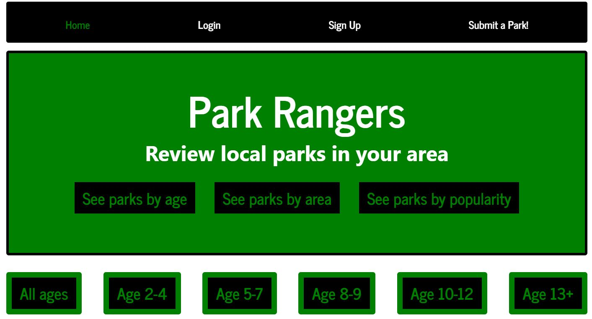

# Parkify
Project 3

## Demo
Here is a working live demo :  https://park-rangers.herokuapp.com/

# WebApp
<table>
<tr>
<td>
A webapp using MongoDB. The app allows the user to either sign-in to their current account or to create a new account. Once an account is made, the user is able to search for and review various parks around their local area. Users are able to search for playgrounds and parks within specific age ranges that would be appropriate for their children. The user can upload pictures, reviews, and comment on whether or not they recommend the park and for what age groups it would be most appropriate. Think of it as a yelp for parks and playgrounds!
</td>
</tr>
</table>

## Motivation

The makers of the app wanted to create a way for neighbors to communicate with each other regarding various parks in the local neighborhood and kid friendliness. It's a way to bring the community together and promote health and physical fitness amoung families. 

<table>
<tr>
<td>

</td>
</tr>
</table>

## Technology

The app utilizes tools such as:
* mongojs
* Mongoose
* Passport
* Axios
* Express
* React

## Going Forward
<table>
<tr>
<td>
Still more to come as it is a work in progress. Going forward, we'd like to incorporate functioning buttons, as well as the ability to search for specific parks with filters applied, such as age, distance, kid friendlyness, etc.

</td>
</tr>
</table>

## Available Scripts

In the project directory, you can run:

### `npm start`

Runs the app in the development mode. 
Open [http://localhost:3000](http://localhost:3000) to view it in the browser.

The page will reload if you make edits. 
You will also see any lint errors in the console.

### `npm test`

Launches the test runner in the interactive watch mode. 
See the section about [running tests](https://facebook.github.io/create-react-app/docs/running-tests) for more information.

### `npm run build`

Builds the app for production to the `build` folder. 
It correctly bundles React in production mode and optimizes the build for the best performance.

The build is minified and the filenames include the hashes. 
Your app is ready to be deployed!

See the section about [deployment](https://facebook.github.io/create-react-app/docs/deployment) for more information.

### `npm run eject`

**Note: this is a one-way operation. Once you `eject`, you can’t go back!**

If you aren’t satisfied with the build tool and configuration choices, you can `eject` at any time. This command will remove the single build dependency from your project.

Instead, it will copy all the configuration files and the transitive dependencies (Webpack, Babel, ESLint, etc) right into your project so you have full control over them. All of the commands except `eject` will still work, but they will point to the copied scripts so you can tweak them. At this point you’re on your own.

You don’t have to ever use `eject`. The curated feature set is suitable for small and middle deployments, and you shouldn’t feel obligated to use this feature. However we understand that this tool wouldn’t be useful if you couldn’t customize it when you are ready for it.

## Learn More

You can learn more in the [Create React App documentation](https://facebook.github.io/create-react-app/docs/getting-started).

To learn React, check out the [React documentation](https://reactjs.org/).

### Code Splitting

This section has moved here: https://facebook.github.io/create-react-app/docs/code-splitting

### Analyzing the Bundle Size

This section has moved here: https://facebook.github.io/create-react-app/docs/analyzing-the-bundle-size

### Making a Progressive Web App

This section has moved here: https://facebook.github.io/create-react-app/docs/making-a-progressive-web-app

### Advanced Configuration

This section has moved here: https://facebook.github.io/create-react-app/docs/advanced-configuration

### Deployment

This section has moved here: https://facebook.github.io/create-react-app/docs/deployment

### `npm run build` fails to minify

This section has moved here: https://facebook.github.io/create-react-app/docs/troubleshooting#npm-run-build-fails-to-minify
